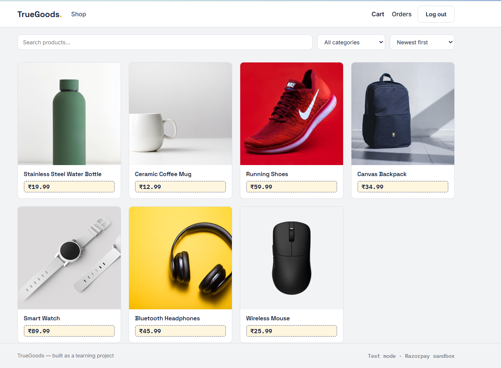
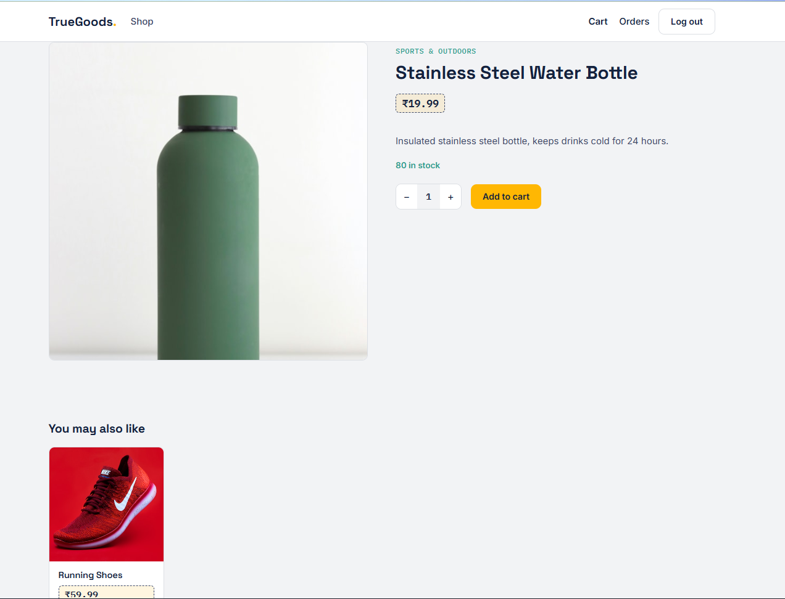
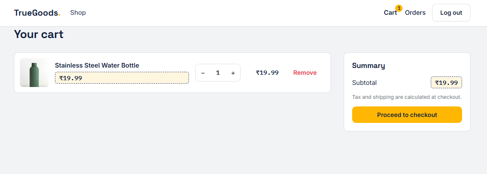
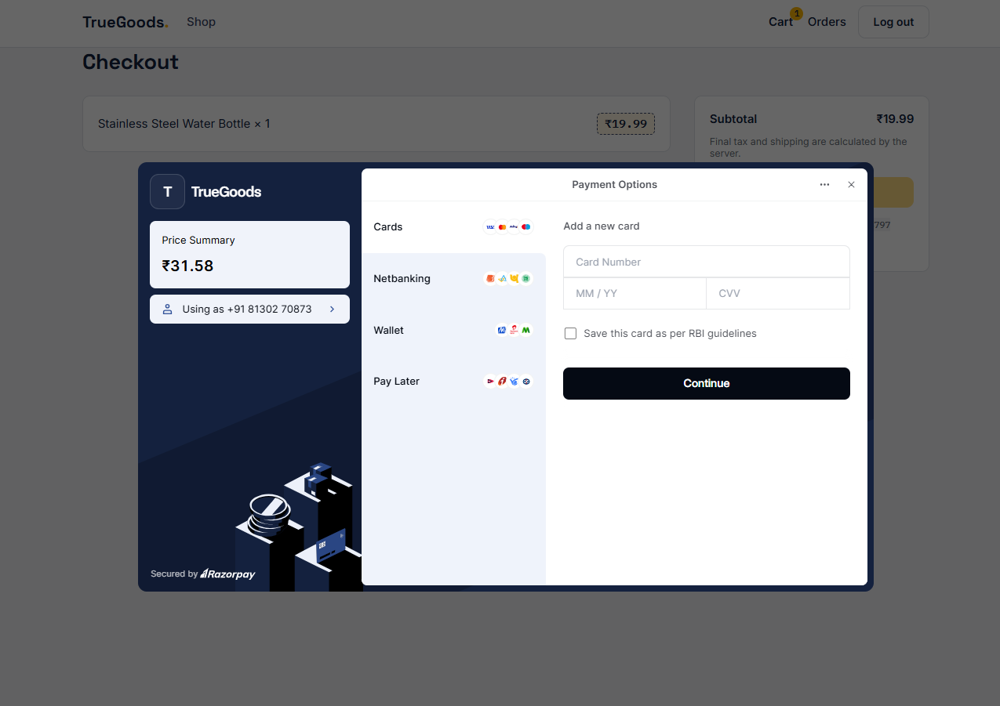
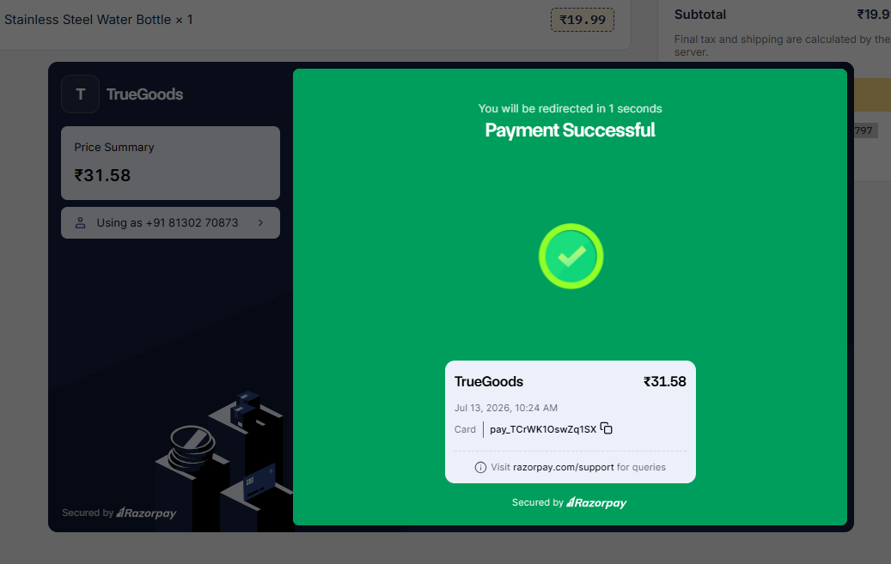
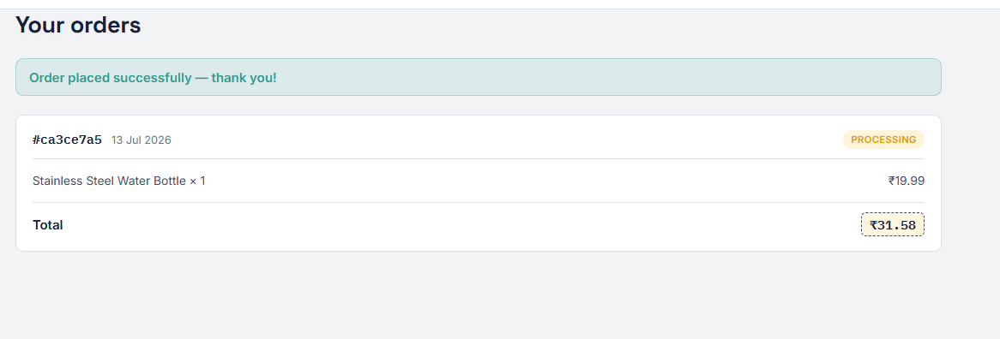
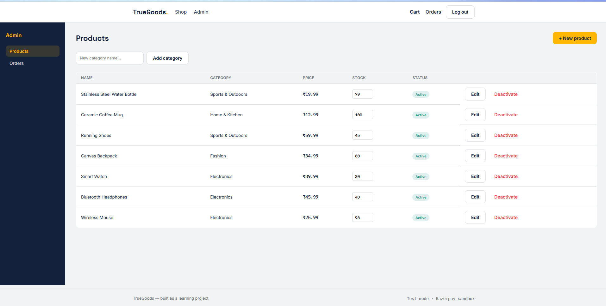
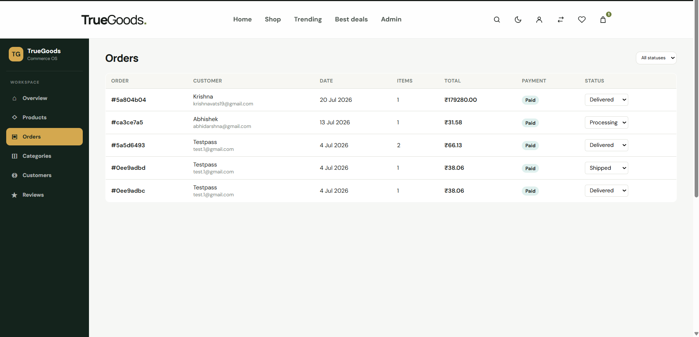

# 🛍️ TrueGoods

<p align="center">
  
</p>

<p align="center">


</p>

<p align="center">

A modern full-stack e-commerce platform built with the MERN stack featuring secure authentication, product management, shopping cart, Razorpay payment integration, order tracking, and a complete admin dashboard.

</p>

---

# 🌟 Features

## Customer

- 🔐 JWT Authentication
- 🛍 Browse Products
- 🔎 Search Products
- 🗂 Category Filters
- ❤️ Product Details
- 🛒 Shopping Cart
- 💳 Razorpay Payment Gateway
- 📦 Order History
- 📱 Responsive Design

---

## Admin

- 📦 Product Management
- 🏷 Category Management
- 📈 Stock Management
- ✏ Edit Products
- ❌ Activate / Deactivate Products
- 📋 Order Management
- 🚚 Update Order Status
- 👤 Role-based Access

---

# 📸 Screenshots

## 🏠 Home


---

## 📦 Product Details



---

## 🛒 Shopping Cart



---

## 💳 Checkout



---

## ✅ Payment Success



---

## 📋 Orders



---

## 🛠 Admin Dashboard

### Product Management



### Order Management



---

# 🛠 Tech Stack

## Frontend

- React
- Vite
- Tailwind CSS
- Axios

## Backend

- Node.js
- Express.js
- MongoDB
- Mongoose

## Authentication

- JWT
- bcrypt

## Payments

- Razorpay

---

# 🏗 Architecture

```
React Frontend
       │
       ▼
Express API
       │
       ▼
MongoDB Database
       │
       ▼
JWT Authentication
       │
       ▼
Razorpay Payment Gateway
```

---

# 📂 Project Structure

```
truegoods/

├── client/
├── server/
├── assets/
└── README.md
```

---

# ⚙ Getting Started

## Clone

```bash
git clone https://github.com/techabhiii03/truegoods.git
```

## Backend

```bash
cd server
npm install
npm run dev
```

## Frontend

```bash
cd client
npm install
npm run dev
```

---

# 🚀 Future Improvements

- Wishlist
- Product Reviews
- Coupons & Discounts
- Email Notifications
- Analytics Dashboard
- Sales Reports
- Cloudinary Image Upload
- Docker Support
- CI/CD Pipeline

---

# 👨‍💻 Author

**Abhishek Sharma**

Full Stack Developer

⭐ If you like this project, consider giving it a star!
