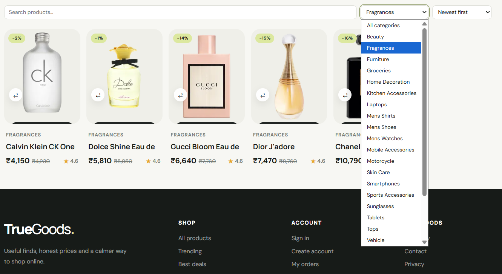
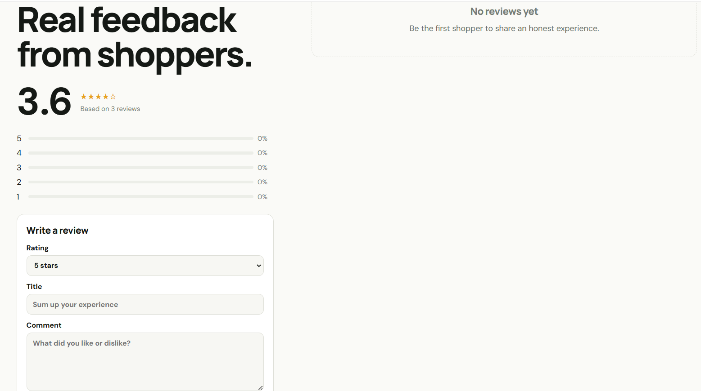

<p align="center">
  
</p>

<h1 align="center">🛍️ TrueGoods</h1>

<p align="center">
A modern full-stack MERN e-commerce platform built to deliver a seamless shopping experience with secure authentication, intelligent product management, responsive design, and a feature-rich admin dashboard.
</p>

<p align="center">


</p>

---

# 📖 Overview

**TrueGoods** is a full-stack e-commerce platform inspired by modern online marketplaces, built using the **MERN Stack**. It provides customers with a smooth shopping experience while equipping administrators with comprehensive tools to manage products, categories, customers, reviews, and orders.

The project emphasizes scalability, clean architecture, responsive UI, secure authentication, and performance optimization, making it suitable as both a learning project and a production-style portfolio application.

---

# ✨ Key Features

## 👤 Customer Experience

- Secure JWT Authentication
- User Registration & Login
- Responsive Home Page
- Product Search & Filtering
- Category Browsing
- Product Details Page
- Wishlist Management
- Shopping Cart
- Checkout Flow
- Order History
- Customer Account Dashboard
- Product Reviews & Ratings
- Fully Responsive Design

---

## 🛠️ Admin Dashboard

- Dashboard Overview
- Product Management (CRUD)
- Category Management
- Customer Management
- Order Management
- Review Moderation
- Inventory Management
- Store Analytics

---

# 📸 Project Preview

## 🏠 Homepage


---

## 🔥 Featured Products


---

## 📂 Categories



---

## 🛍️ Shop Filters


---

## 📄 Product Details


---

## ⭐ Customer Reviews



---

## 👤 My Account


---

## ⚙️ Admin Dashboard


---

## 📦 Product Management


---

## 👥 Customer Management


---

## 📑 Order Management


---

# 🏗️ Tech Stack

### Frontend

- React.js
- Vite
- Tailwind CSS
- React Router DOM
- Axios

### Backend

- Node.js
- Express.js

### Database

- MongoDB
- Mongoose

### Authentication & Security

- JWT Authentication
- bcrypt Password Hashing

### Payment Integration

- Razorpay

### Development Tools

- Git & GitHub
- Postman
- VS Code

---

# ⚡ Performance Optimizations

To improve the overall user experience, the application includes:

- Route-based Code Splitting
- Lazy Loading
- Optimized Product Images
- Skeleton Loading Screens
- Responsive Layouts
- Optimized Build Bundles
- Efficient API Requests

---

# 📂 Project Structure

```text
TrueGoods
│
├── assets/
│
├── client/
│   ├── public/
│   ├── src/
│   └── package.json
│
├── server/
│   ├── config/
│   ├── controllers/
│   ├── middleware/
│   ├── models/
│   ├── routes/
│   ├── utils/
│   └── package.json
│
├── README.md
└── .gitignore
```

---

# 🚀 Installation

## Clone the Repository

```bash
git clone https://github.com/techabhiii03/truegoods-ecommerce.git

cd truegoods-ecommerce
```

---

## Install Backend

```bash
cd server
npm install
npm run dev
```

---

## Install Frontend

```bash
cd client
npm install
npm run dev
```

---

# 🔐 Environment Variables

Create a `.env` file inside the `server` directory.

```env
PORT=

MONGO_URI=

JWT_SECRET=

RAZORPAY_KEY_ID=

RAZORPAY_KEY_SECRET=

CLIENT_URL=
```

---

# 🎯 Future Enhancements

Although the project is feature-complete, there are several planned improvements:

- AI Shopping Assistant
- Voice Search
- Image-Based Product Search
- Push Notifications
- Progressive Web App (PWA)
- Multi-language Support
- 3D Product Viewer

---

# 🤝 Contributing

Contributions are welcome. If you have ideas to improve the project, feel free to fork the repository, create a new branch, and submit a pull request.

---

# 👨‍💻 Developer

**Abhishek Sharma**

- 💼 LinkedIn: https://www.linkedin.com/in/abhiishek-sharma/
- 💻 GitHub: https://github.com/techabhiii03

---

# ⭐ Support

If you found this project useful or learned something from it, consider giving it a ⭐ on GitHub. It helps the project reach more developers and supports future improvements.

---

<div align="center">

**Built with ❤️ using the MERN Stack**

</div>