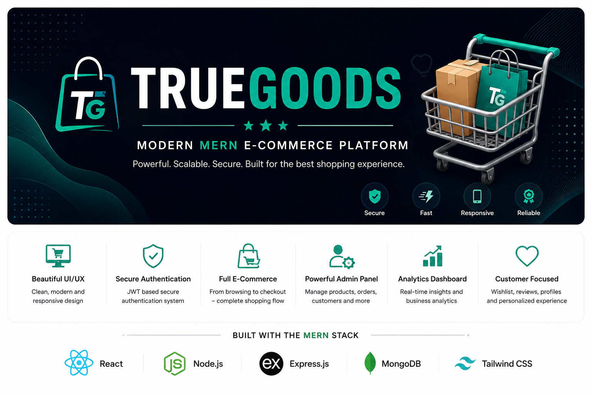
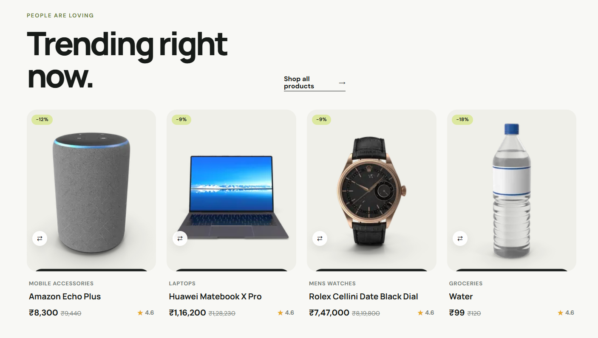
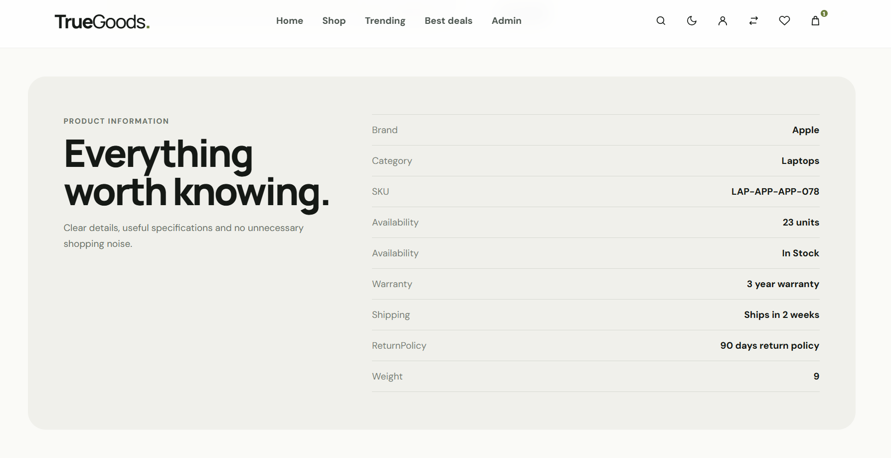
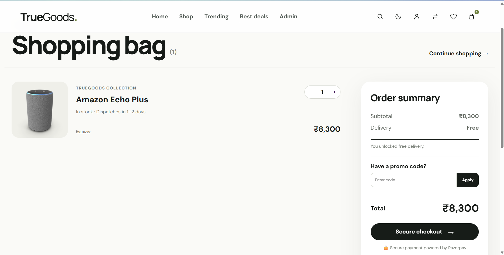
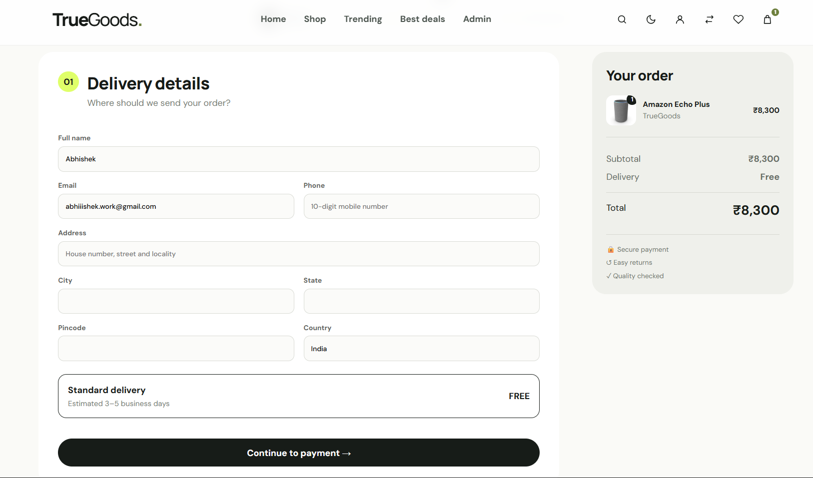
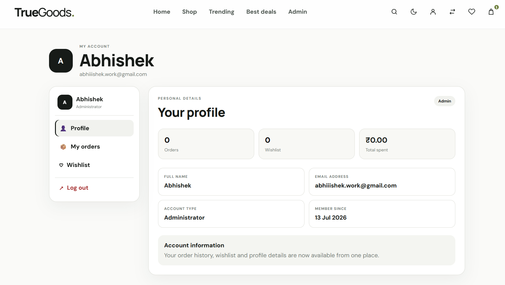
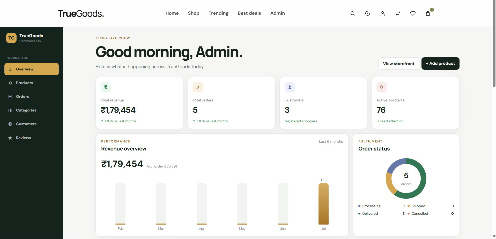

<p align="center">
  
</p>

<h1 align="center">🛍️ TrueGoods</h1>

<p align="center">
A production-ready MERN Stack E-Commerce Platform built with scalability, security, and modern web development practices in mind.
</p>

<p align="center">

<a href="https://truegoods-ecommerce-platform.vercel.app">

</a>

<a href="https://github.com/techabhiii03/truegoods-ecommerce-platform">

</a>


</p>

<p align="center">


</p>

---

# 🌟 Overview

TrueGoods is a modern full-stack e-commerce platform developed using the **MERN Stack**. It was designed to simulate the architecture and workflow of a real-world online shopping application while following production-level development practices.

The platform enables customers to browse products, manage wishlists, compare products, securely authenticate, place orders, and manage their accounts through an intuitive and responsive interface. On the administrative side, it provides a dedicated dashboard for managing products, categories, users, reviews, and customer orders.

Unlike a basic CRUD application, TrueGoods focuses on building a scalable and secure architecture with JWT authentication, refresh tokens, role-based authorization, reusable React components, cloud deployment, and a structured backend API.

---

# 💡 Why I Built TrueGoods

The goal behind TrueGoods was to move beyond tutorial-based projects and build something that closely resembles a production-ready e-commerce application.

Throughout the development process, I focused on solving real engineering challenges rather than simply implementing features. This project involved designing RESTful APIs, securing authentication with JWT and refresh tokens, handling production deployments, configuring cloud databases, resolving CORS and routing issues, and optimizing the overall user experience.

Building TrueGoods helped me strengthen my understanding of full-stack application architecture, deployment workflows, authentication systems, and scalable frontend development.

---

# 🚀 Live Application

### 🌐 Live Website

https://truegoods-ecommerce-platform.vercel.app

### 💻 GitHub Repository

https://github.com/techabhiii03/truegoods-ecommerce-platform

> **Note:** The backend is hosted on Render's free tier. If the application has been inactive, the first request may take around **30–60 seconds** while the server wakes up.

---

# ✨ Key Features

## 👤 Customer Experience

- 🔐 Secure JWT Authentication
- 🔄 Refresh Token Authentication
- 🛍️ Browse Products
- 🔎 Smart Search & Filters
- 📂 Category Browsing
- ❤️ Wishlist Management
- ⚖️ Product Comparison
- 🛒 Shopping Cart
- 💳 Razorpay Payment Integration
- 📦 Order History
- ⭐ Product Reviews & Ratings
- 👤 Customer Dashboard
- 📱 Fully Responsive Design

---

## 🛠️ Admin Dashboard

- 📊 Dashboard Analytics
- 📦 Product Management
- 🗂️ Category Management
- 👥 Customer Management
- 📋 Order Management
- ⭐ Review Moderation
- 📈 Inventory Control
- 🔒 Admin Protected Routes

---

## 🔒 Security

- JWT Authentication
- Refresh Token Cookies
- HTTP-only Cookies
- Role-Based Authorization
- Protected Routes
- Password Hashing using bcrypt
- Secure CORS Configuration
- Environment Variable Protection

---

## ⚡ Performance

- Lazy Loading
- Route-Based Code Splitting
- Optimized Images
- Responsive Layouts
- Reusable React Components
- Axios API Layer
- Production Build Optimization

---

# 📊 Project Highlights

| Feature | Status |
|----------|:------:|
| Production Deployment | ✅ |
| MERN Stack | ✅ |
| JWT Authentication | ✅ |
| Refresh Tokens | ✅ |
| Admin Dashboard | ✅ |
| Shopping Cart | ✅ |
| Wishlist | ✅ |
| Product Comparison | ✅ |
| Razorpay Integration | ✅ |
| Reviews & Ratings | ✅ |
| MongoDB Atlas | ✅ |
| Responsive UI | ✅ |

---

# 📈 Project At A Glance

| Metric | Value |
|---------|------:|
| Frontend Pages | 15+ |
| REST APIs | 25+ |
| Categories | 15+ |
| Products | 75+ |
| Admin Modules | 6 |
| Authentication | JWT + Refresh Token |
| Database | MongoDB Atlas |
| Deployment | Vercel + Render |

# 🛠️ Technology Stack

## 🎨 Frontend

| Technology | Purpose |
|------------|----------|
| React.js | Component-Based UI Development |
| Vite | Lightning Fast Build Tool |
| React Router | Client-side Routing |
| Axios | API Communication |
| Context API | Global State Management |
| CSS3 | Responsive Styling |

---

## ⚙️ Backend

| Technology | Purpose |
|------------|----------|
| Node.js | JavaScript Runtime |
| Express.js | REST API Development |
| JWT | Authentication |
| bcrypt.js | Password Encryption |
| Cookie Parser | Secure Cookie Management |
| CORS | Cross-Origin Requests |

---

## 🗄️ Database

| Technology | Purpose |
|------------|----------|
| MongoDB Atlas | Cloud Database |
| Mongoose | ODM |

---

## 💳 Payment Gateway

| Technology | Purpose |
|------------|----------|
| Razorpay | Secure Payment Integration |

---

## ☁️ Deployment

| Platform | Usage |
|----------|-------|
| Vercel | Frontend Hosting |
| Render | Backend Hosting |
| MongoDB Atlas | Database Hosting |

---

## 🧰 Development Tools

- Visual Studio Code
- Git
- GitHub
- Postman
- npm
- Render Dashboard
- Vercel Dashboard

---

# 🏗️ System Architecture

```text
                     ┌────────────────────────┐
                     │        User            │
                     └────────────┬───────────┘
                                  │
                                  ▼
                     ┌────────────────────────┐
                     │   React + Vite Client  │
                     │       (Vercel)         │
                     └────────────┬───────────┘
                                  │
                             Axios Requests
                                  │
                                  ▼
                     ┌────────────────────────┐
                     │ Express.js REST API    │
                     │       (Render)         │
                     └────────────┬───────────┘
                                  │
                 ┌────────────────┴────────────────┐
                 │                                 │
                 ▼                                 ▼
          JWT Authentication                MongoDB Atlas
        Refresh Token Cookies                 Cloud Database
```

---

# 📂 Project Structure

```text
TrueGoods
│
├── client
│   ├── public
│   ├── src
│   │   ├── api
│   │   ├── assets
│   │   ├── components
│   │   ├── context
│   │   ├── hooks
│   │   ├── pages
│   │   ├── routes
│   │   ├── services
│   │   ├── styles
│   │   └── utils
│   │
│   ├── package.json
│   └── vite.config.js
│
├── server
│   ├── src
│   │   ├── config
│   │   ├── controllers
│   │   ├── middleware
│   │   ├── models
│   │   ├── routes
│   │   ├── scripts
│   │   ├── utils
│   │   └── server.js
│   │
│   ├── package.json
│   └── .env
│
├── assets
│   ├── Banner.png
│   ├── Home.png
│   ├── Products.png
│   ├── ProductDetails.png
│   ├── Wishlist.png
│   ├── Compare.png
│   ├── Cart.png
│   ├── Checkout.png
│   ├── Profile.png
│   ├── AdminDashboard.png
│   ├── AdminProducts.png
│   ├── AdminCustomers.png
│   └── AdminOrders.png
│
└── README.md
```

---

# 📸 Application Preview

## 🏠 Home Page

<p align="center">

</p>

---

## 🛍️ Product Listing

<p align="center">

</p>

---

## 📄 Product Details

<p align="center">

</p>

---


## 🛒 Shopping Cart

<p align="center">

</p>

---

## 💳 Checkout

<p align="center">

</p>

---

## 👤 Customer Dashboard

<p align="center">

</p>

---

## 📊 Admin Dashboard

<p align="center">

</p>

---

## 📦 Product Management

<p align="center">

</p>

---

## 👥 Customer Management

<p align="center">

</p>

---

## 📋 Order Management

<p align="center">

</p>

# 🚀 Getting Started

Follow these steps to set up TrueGoods on your local machine.

---

## 1️⃣ Clone the Repository

```bash
git clone https://github.com/techabhiii03/truegoods-ecommerce-platform.git

cd truegoods-ecommerce-platform
```

---

## 2️⃣ Install Dependencies

### Frontend

```bash
cd client

npm install
```

### Backend

```bash
cd server

npm install
```

---

## 3️⃣ Configure Environment Variables

### Backend (`server/.env`)

```env
PORT=5000

NODE_ENV=development

MONGO_URI=your_mongodb_connection_string

JWT_SECRET=your_jwt_secret

JWT_REFRESH_SECRET=your_refresh_secret

JWT_EXPIRES_IN=15m

JWT_REFRESH_EXPIRES_IN=7d

RAZORPAY_KEY_ID=your_key

RAZORPAY_KEY_SECRET=your_secret

CLIENT_URL=http://localhost:5173
```

---

### Frontend (`client/.env`)

```env
VITE_API_URL=http://localhost:5000/api
```

---

## 4️⃣ Start the Development Server

### Backend

```bash
cd server

npm run dev
```

---

### Frontend

```bash
cd client

npm run dev
```

---

## 5️⃣ Open the Application

```
Frontend
http://localhost:5173

Backend
http://localhost:5000
```

---

# 📜 Available Scripts

## Client

| Command | Description |
|----------|-------------|
| npm run dev | Start development server |
| npm run build | Build production version |
| npm run preview | Preview production build |
| npm run lint | Run ESLint |

---

## Server

| Command | Description |
|----------|-------------|
| npm run dev | Start development server |
| npm start | Start production server |
| npm run seed | Seed sample products |
| npm run seed:append | Append sample products |
| npm run seed:check | Validate catalog |
| npm run migrate:images | Update product image paths |
| npm run catalog:audit | Audit product catalog |
| npm run catalog:curate | Curate product catalog |

---

# 🌐 Deployment

## Frontend

The frontend is deployed using **Vercel**.

```text
https://truegoods-ecommerce-platform.vercel.app
```

---

## Backend

The backend API is deployed using **Render**.

```text
https://truegoods-ecommerce-platform.onrender.com
```

---

## Database

MongoDB Atlas is used as the cloud-hosted database for storing users, products, carts, orders, reviews, and categories.

---

# 🔌 API Overview

## Authentication

| Method | Endpoint | Description |
|--------|----------|-------------|
| POST | `/api/auth/register` | Register a new account |
| POST | `/api/auth/login` | Login |
| POST | `/api/auth/refresh` | Refresh JWT token |
| POST | `/api/auth/logout` | Logout |
| GET | `/api/auth/me` | Get current user |

---

## Products

| Method | Endpoint |
|--------|----------|
| GET | `/api/products` |
| GET | `/api/products/:slug` |

---

## Categories

| Method | Endpoint |
|--------|----------|
| GET | `/api/categories` |

---

## Cart

| Method | Endpoint |
|--------|----------|
| GET | `/api/cart` |
| POST | `/api/cart/items` |
| PATCH | `/api/cart/items/:productId` |
| DELETE | `/api/cart/items/:productId` |
| DELETE | `/api/cart` |

---

## Orders

| Method | Endpoint |
|--------|----------|
| POST | `/api/checkout` |
| GET | `/api/orders` |

---

## Reviews

| Method | Endpoint |
|--------|----------|
| GET | `/api/reviews/:productId` |
| POST | `/api/reviews` |

---

## Admin

- Product Management
- Category Management
- Customer Management
- Review Management
- Order Management

---

# 📈 Performance & Optimizations

TrueGoods has been developed with production-ready optimization techniques to deliver a smooth and responsive user experience.

### Frontend

- ⚡ Route-Based Code Splitting
- ⚡ Lazy Loading
- 🖼️ Optimized Images
- 📱 Mobile-First Responsive Layout
- ♻️ Reusable React Components
- 🔄 Efficient Axios API Layer

### Backend

- JWT Authentication
- Refresh Token Authentication
- HTTP-only Cookies
- Secure CORS Configuration
- Protected Routes
- Optimized MongoDB Queries

---

# 🧪 Testing Checklist

✔ User Registration

✔ User Login

✔ Refresh Token Authentication

✔ Product Browsing

✔ Category Filtering

✔ Search Functionality

✔ Wishlist

✔ Product Comparison

✔ Shopping Cart

✔ Checkout

✔ Orders

✔ Reviews

✔ Admin Dashboard

✔ Responsive Design

✔ Production Deployment

# 🚧 Challenges & Learning

Building TrueGoods was more than implementing features—it involved solving real-world development and deployment challenges.

### Challenges Solved

- 🔐 Implemented secure JWT Authentication with Refresh Tokens
- 🍪 Configured HTTP-only Cookies for enhanced security
- 🌐 Resolved Cross-Origin Resource Sharing (CORS) issues between Vercel and Render
- 🚀 Deployed frontend and backend on separate cloud platforms
- 🔄 Fixed Single Page Application (SPA) routing for production deployment
- 📦 Designed reusable React components to improve maintainability
- ⚡ Optimized API communication using Axios interceptors
- 🗄️ Integrated MongoDB Atlas for cloud-hosted data storage
- 💳 Implemented secure payment flow using Razorpay
- 📱 Built a responsive interface for desktop, tablet, and mobile devices

---

# 📚 What I Learned

Developing TrueGoods helped strengthen my understanding of full-stack application development and production deployment.

Some of the key concepts I explored include:

- MERN Stack Architecture
- RESTful API Design
- Authentication & Authorization
- Refresh Token Workflow
- Secure Cookie Management
- MongoDB Schema Design
- Context API State Management
- Cloud Deployment
- Git & GitHub Workflow
- Production Debugging
- Performance Optimization
- Responsive UI Development

---

# 🚀 Future Roadmap

TrueGoods is production-ready, but several enhancements are planned for future releases.

### Planned Features

- 🤖 AI Shopping Assistant
- 🎙️ Voice Search
- 📸 Image-Based Product Search
- 📱 Progressive Web App (PWA)
- 🔔 Push Notifications
- 🌍 Multi-language Support
- 🥽 3D Product Viewer
- 📊 Advanced Analytics Dashboard
- ❤️ Personalized Product Recommendations
- 💬 Live Customer Support Chat
- 📦 Shipment Tracking
- 🎁 Coupons & Promotional Offers

---

# 🤝 Contributing

Contributions are always welcome!

If you'd like to improve this project:

1. Fork the repository
2. Create your feature branch

```bash
git checkout -b feature/NewFeature
```

3. Commit your changes

```bash
git commit -m "Add New Feature"
```

4. Push your branch

```bash
git push origin feature/NewFeature
```

5. Open a Pull Request

Every contribution—whether it's fixing a bug, improving the UI, or adding new functionality—is appreciated.

---

# 👨‍💻 About the Developer

<div align="center">

## Abhishek Sharma

### Full Stack Developer | MERN Stack Enthusiast | Computer Science Engineering Student

Passionate about building scalable web applications and solving real-world problems through clean, maintainable code. I enjoy transforming ideas into production-ready applications while continuously learning modern technologies and best development practices.

</div>

---

## 🌐 Connect With Me

<p align="center">

<a href="https://github.com/techabhiii03">

</a>

<a href="https://www.linkedin.com/in/abhiishek-sharma/">

</a>

</p>

---

# 📄 License

This project is licensed under the **MIT License**.

You are welcome to learn from, modify, and build upon this project for educational and personal purposes.

---

# ⭐ Show Your Support

If you found this project useful or interesting, please consider giving it a ⭐ on GitHub.

Your support motivates me to continue building high-quality projects and sharing them with the developer community.

---

# 🙏 Acknowledgements

Special thanks to the open-source community and the creators of the amazing tools and technologies that made this project possible.

- React Team
- Node.js
- Express.js
- MongoDB
- Vercel
- Render
- Razorpay
- GitHub

---

<div align="center">

# 🛍️ TrueGoods

### From planning to deployment — built one feature, one bug fix, and one commit at a time.

⭐ **If you enjoyed this project, don't forget to leave a star!**

Made with ❤️ by **Abhishek Sharma**

</div>