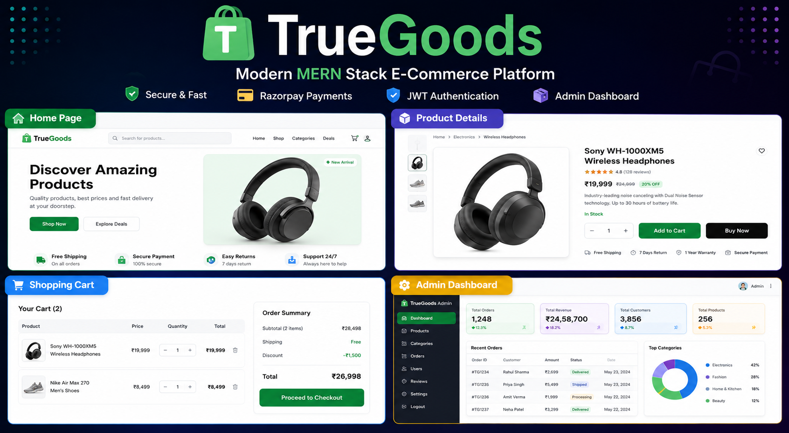

# 🛍️ TrueGoods

<p align="center">
  
</p>

<h3 align="center">
Modern Full-Stack E-Commerce Platform built with the MERN Stack
</h3>
<p align="center">

🚀 **Production-Ready** • 🔐 **JWT Authentication** • 💳 **Razorpay Payments** • 👨‍💼 **Admin Dashboard** • 📦 **Order Management**

</p>

---

<p align="center">


</p>

<p align="center">

A modern full-stack e-commerce platform featuring secure authentication, product management, shopping cart, Razorpay payment integration, order tracking, and a complete admin dashboard.

</p>

---
## 📑 Table of Contents

- [✨ Features](#-features)
- [🛍 Customer Experience](#-customer-experience)
- [⚙ Admin Dashboard](#-admin-dashboard)
- [📸 Screenshots](#-screenshots)
- [🛠 Tech Stack](#-tech-stack)
- [🏗 Architecture](#-architecture)
- [⚙ Installation](#-installation)
- [🚀 Future Improvements](#-future-improvements)

# ✨ Features

TrueGoods is designed to deliver a complete online shopping experience for both customers and administrators.

## 🛍 Customer Experience

- 🔐 Secure JWT Authentication
- 🛒 Add, Update & Remove Cart Items
- 🔎 Product Search
- 🗂 Category-based Filtering
- 📄 Product Details Page
- 💳 Secure Razorpay Payment Integration
- 📦 Order History & Tracking
- 👤 User Profile Management
- 📱 Fully Responsive Design

---

## ⚙ Admin Dashboard

- 📦 Product Management (CRUD)
- 🏷 Category Management
- 📈 Stock Management
- ✏ Edit Product Details
- 🚫 Activate / Deactivate Products
- 📋 Order Management
- 🚚 Update Order Status
- 👨‍💼 Role-based Admin Access

# 📸 Screenshots

## 🏠 Home Page

Browse featured products, explore categories, and discover the latest arrivals.


---

## 📦 Product Details

View detailed product information, pricing, ratings, and add items to your cart.


---

## 🛒 Shopping Cart

Manage quantities, review your order, and proceed to checkout.


---

## 💳 Secure Checkout

Integrated Razorpay payment gateway for a seamless checkout experience.


---

## ✅ Payment Success

Order confirmation after successful payment.


---

## 📋 Order History

Customers can track all their previous orders and their current status.


---


### 📦 Product Management

Create, edit, update inventory, and manage products.


### 📋 Order Management

Manage customer orders and update delivery status.


# 🛠 Tech Stack

## Frontend

- ⚛️ React.js
- ⚡ Vite
- 🎨 Tailwind CSS
- 🌐 Axios

---

## Backend

- 🟢 Node.js
- 🚀 Express.js
- 🍃 MongoDB
- 🗄️ Mongoose

---

## Authentication

- 🔐 JSON Web Token (JWT)
- 🔒 bcrypt.js

---

## Payment Gateway

- 💳 Razorpay

---

## Tools & Deployment

- Git
- GitHub
- VS Code

<<<<<<< HEAD
# 🏗️ System Architecture

```text
                    ┌────────────────────┐
                    │    React Client    │
                    └─────────┬──────────┘
                              │
                       REST API Requests
                              │
                    ┌─────────▼──────────┐
                    │   Express Server   │
                    └─────────┬──────────┘
                              │
        ┌─────────────────────┼─────────────────────┐
        │                     │                     │
        ▼                     ▼                     ▼
   MongoDB Database      JWT Authentication    Razorpay API
=======
├── client/
├── server/
├── assets/
└── README.md
>>>>>>> origin/main
```

### Request Flow

User → React → Express API → MongoDB  
                        ↘ JWT Authentication  
                        ↘ Razorpay Payment Gateway

# ⚙️ Installation

## Clone the Repository

```bash
git clone https://github.com/techabhiii03/truegoods-ecommerce-platform.git
```

## Navigate to the Project

```bash
cd truegoods-ecommerce-platform
```

## Backend Setup

```bash
cd server
npm install
npm run dev
```

## Frontend Setup

```bash
cd client
npm install
npm run dev
```

---

### Environment Variables

Create a `.env` file inside the `server` folder and configure:

```env
MONGO_URI=your_mongodb_connection_string
JWT_SECRET=your_jwt_secret
RAZORPAY_KEY_ID=your_key
RAZORPAY_KEY_SECRET=your_secret
```

># ⚙️ Installation

## Clone the Repository

```bash
git clone https://github.com/techabhiii03/truegoods-ecommerce-platform.git
```

## Navigate to the Project

```bash
cd truegoods-ecommerce-platform
```

## Backend Setup

```bash
cd server
npm install
npm run dev
```

## Frontend Setup

```bash
cd client
npm install
npm run dev
```

---

### Environment Variables

Create a `.env` file inside the `server` folder and configure:

```env
MONGO_URI=your_mongodb_connection_string
JWT_SECRET=your_jwt_secret
RAZORPAY_KEY_ID=your_key
RAZORPAY_KEY_SECRET=your_secret
```

<<<<<<< HEAD
# 🚀 Future Roadmap

The following enhancements are planned for future releases:

- ❤️ Wishlist functionality
- ⭐ Product ratings & reviews
- 🎟 Coupon & discount system
- 📧 Email notifications
- 📊 Sales analytics dashboard
- ☁️ Cloudinary image storage
- 📱 Progressive Web App (PWA)
- 🐳 Docker support
- 🔄 CI/CD pipeline
- 🤖 AI-powered product recommendations

## 🔗 Live Demo

🚧 Coming Soon

# 👨‍💻 About the Developer

Hi, I'm **Abhishek Sharma**, a Full Stack Developer passionate about building scalable web applications and solving real-world problems with modern technologies.

### Connect with me

- 💼 LinkedIn: *(https://www.linkedin.com/in/abhiishek-sharma-96ba38378/)*
- 🐙 GitHub: https://github.com/techabhiii03
- 🌐 Portfolio: *(Coming Soon)*

---

⭐ **If you found this project interesting, consider giving it a Star!**
=======
⭐ If you like this project, consider giving it a star!
>>>>>>> origin/main
